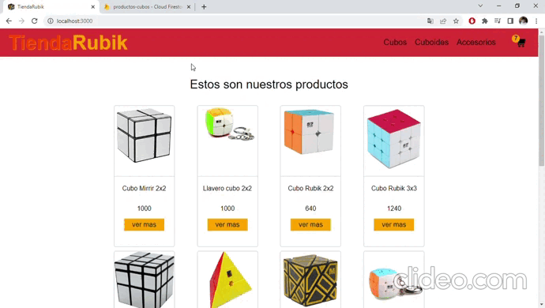

# Tienda Rubik
***
El proyecto simula un ecommerce de una tienda de cubos rubik. En la tienda podemos seleccionar un producto, ver su detalle y agregar al carrito la cantidad que vamos a comprar. Para finalizar la compra tendremos que completar un formulario con nuestros datos personales y nos generara un tiket de la compra. 

**Tecnologias utilizadas**

- **React** (Create app)
- **React router dom** (Define las rutas de navegacion).
- **Firebase** (Base de datos)
- **Notiflix** (sistema de notificaciones)

## Vista previa del sitio web

[TiendaRubik](https://pre-entrega-gaona-correa-hrkx0b89p-gaona21.vercel.app/)